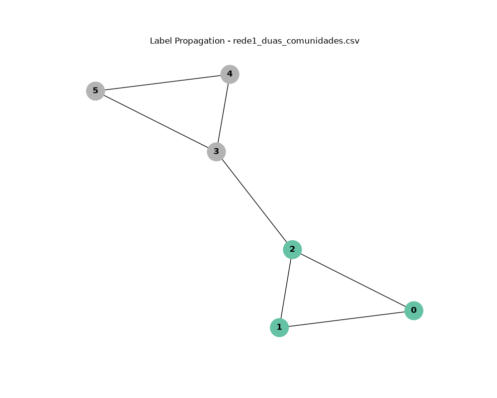
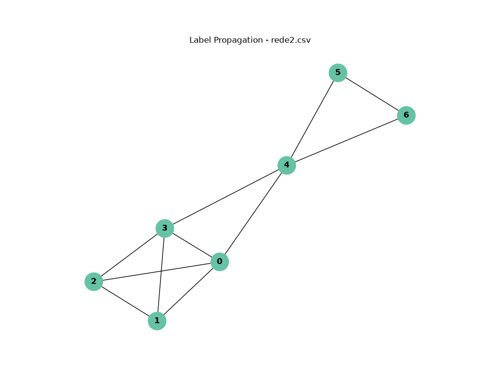
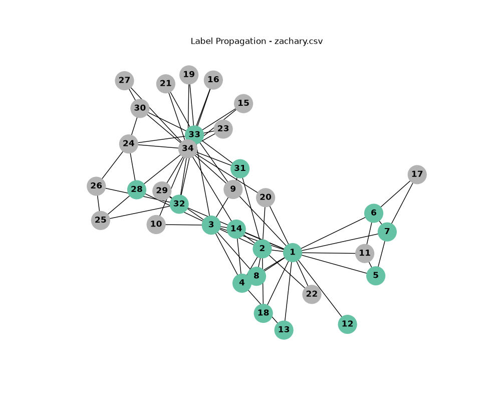

# Detecção de Comunidades (Label Propagation)

## 1. Instruções para Clonar e Criar o Ambiente Conda

**Passo 1: Clonar o repositório**
```bash
git clone https://github.com/nbryaveloso/ufsj-ds-label-propagation.git
cd ufsj-ds-label-propagation
```

**Passo 2: Configurar o ambiente**
O projeto inclui um arquivo `environment.yml` com as dependências necessárias. Execute os comandos abaixo no terminal para recriar e ativar o ambiente:

```bash
conda env create -f environment.yml
conda activate label-propagation
```

## 2. Relatório de Testes e Resultados

O algoritmo foi testado em três datasets distintos, apresentando os seguintes comportamentos:

### Dataset 1: Rede 1 (Grafo Simples)

> **Análise:** A rede convergiu rapidamente e formou exatamente duas comunidades simétricas, correspondendo ao comportamento esperado e citado pela professora nos comentários do arquivo `.csv`.

### Dataset 2: Rede 2 (Rede Densa)

> **Análise:** Trata-se de uma rede com uma carga maior de conexões. Devido à alta densidade e às pontes fortes entre os nós, a propagação unificou toda a estrutura, resultando em um grafo formado por uma única comunidade.

### Dataset 3: Zachary's Karate Club

> **Análise:** Na famosa rede do clube de karatê, o algoritmo atuou com sucesso separando o grafo nas comunidades principais. 
> *Curiosidade do Algoritmo:* Embora a divisão clássica seja em 2 facções, a natureza estocástica (aleatória) do desempate de rótulos do *Label Propagation* permite que, dependendo da execução, a rede se fragmente em 3 ou mais subcomunidades. No teste oficial plotado acima, a divisão binária esperada prevaleceu.

## 3. Principais Dificuldades Encontradas

Durante a implementação do algoritmo do zero, as principais dificuldades e aprendizados envolveram três pilares:

1. **Lógica Matemática e Bibliotecas Novas:** A barreira inicial foi traduzir a matemática do papel para o código. Entender como realizar o desempate estocástico dos vértices de forma correta e aprender a utilizar novas bibliotecas para essas operações, como o `NumPy` (`np`) para a álgebra e o `NetworkX` (`nx`) para a estrutura do grafo, exigiu bastante estudo.
2. **Modularização e Clean Code:** O desafio não se resumiu apenas a pesquisar e aprender a usar as funções, mas sim a arquitetar o projeto. Exigiu bastante esforço escrever um código limpo, dividindo as responsabilidades em funções organizadas e unindo todas as partes (leitura, processamento e plotagem) em um fluxo simétrico, coeso e fácil de manter.
3. **Visualização Gráfica:** A renderização dos resultados foi um desafio à parte. Aprender a dominar os parâmetros de plotagem para evitar que os vértices ficassem embolados ou visualmente confusos foi complicado no início, mas se provou um aprendizado muito gratificante e divertido ao final da implementação.